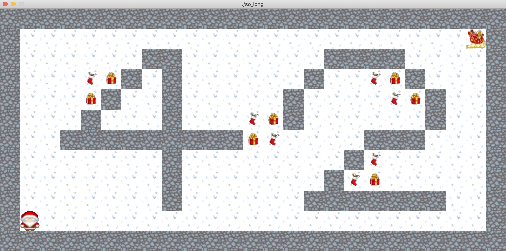

# 42_so_long / 2D Game 프로그램 만들기 🎈

<br>

## 0. Introduction
- This project is a very small 2D game.
- The player’s goal is to collect every collectible present on the map, then escape
- **Library** : MiniLibX (school graphical library)
    - This library was developed internally and includes basic necessary tools to open a window, create images and deal with keyboard and mouse events.

- **Skills** : window management, event handling, colors, textures, and so forth.


<h5>ScreenShot</h5>



**HOW TO USE ?**
1. git clone repository
2. type this command in terminal : ```make```
3. execute so_long file in terminal : ```./so_long maps/valid_42.ber ```

<br>
<br>

## 1. so_long 구상
1. main함수 실행 시, argc argv를 통해 map 파일경로 정보 주기
    ```c
        ./so_long maps/big_map.ber
    ```
    - 맵 하나만 입력 받았는지 확인 (ac = 2)
    - 확장자 .ber인지 확인 (av[1] 확인)
    - 주어진 경로에 위치한 map 파일 오픈해서 오류 없는지 체크
2. fd를 read해서 1차원 배열 만들기
    - 만드는 도중, map에 대한 규칙 어긋나는 것 있는지 확인
    ```c
    /* 
    예외 사항 처리 할 것들
        1. 이상한 문자 나올 시 처리, 
        2. 출구 하나인지 확인, 
        3. 시작 지점 하나인지 확인, 
        4. 수집품 0개인지 확인, 
        5. 지도가 직사각형인지 확인
        6. 지도가 벽으로 둘러싸여 있지 않은 경우 
        7. 지도에 유효한 경로가 없는 경우 (입구 -> 수집품 모두 GET -> 출구)) 
    */
    ```
3. 만든 1차원 배열을 mlx해서 map 만들기
4. key 누를 때 마다 받고 -> 변경 -> 다시 그리기

<br>

## 2. so_long 구현

### so_long.c

- **int	main(int ac, char \*\*av)**
    1. **so_long 준비단계**
        - int	check_ac_av(int ac, char *av)
        - void	initialize_map_info(t_check_map *info)
    2. **so_long 맵 읽기단계**
        - char	*read_map(int fd, t_check_map *info)
    3. **so_long 맵 체크단계**
        - int	check_map_cnt(t_check_map *info)
        - int	check_map_wall(char *map, t_check_map info, int index)
        - int	check_map_dfs(char *map, t_check_map *info)
    4. **so_long mlx 단계**
        - void	run_mlx(t_check_map *map)   

### (1) so_long_ready.c (준비단계)
- int	check_ac_av(int ac, char *av)
    - ac, av 알맞게 왔는지 체크하는 함수
- void	initialize_map_info(t_check_map *info)
    - map_info 구조체 초기화하는 함수
### (2) so_long_read.c (지도 읽기단계)
- char	*read_map(int fd, t_check_map *info)
    - map을 read해서 1차원 배열로 리턴하는 함수로 저번 과제에서 만든 GNL을 활용
        - get_next_line.c / get_next_line_utils.c (GNL 코드)
### (3) so_long_check.c (지도 체크단계)
- int	check_map_cnt(t_check_map *info)
    - 'C' 수집품이 1개 이상인지, 'E' 출구가 1개인지, 'P' 출발점이 1개인지 확인하는 함수
- int	check_map_wall(char *map, t_check_map info, int index)
    - 지도가 '1' 벽으로 둘러싸여 있는지 확인 하는 함수
- int	check_map_dfs(char *map, t_check_map *info)
    - ['P' 출발 -> 'C' 모든 수집품  -> 'E' 출구] 과정이 이루어질 수 있는지 확인하는 함수

### (4) so_long_screen.c / so_long_event.c (mlx 단계)
- void	run_mlx(t_check_map *map)
    - mlx를 실행 및 유지 시키는 함수
- 게임 시작 및 화면 띄우는 코드 : so_long_screen.c 파일에 분류
- 게임 실행 중, 이벤트 발생 시 처리해야 할 코드 : so_long_event.c 파일에 분류